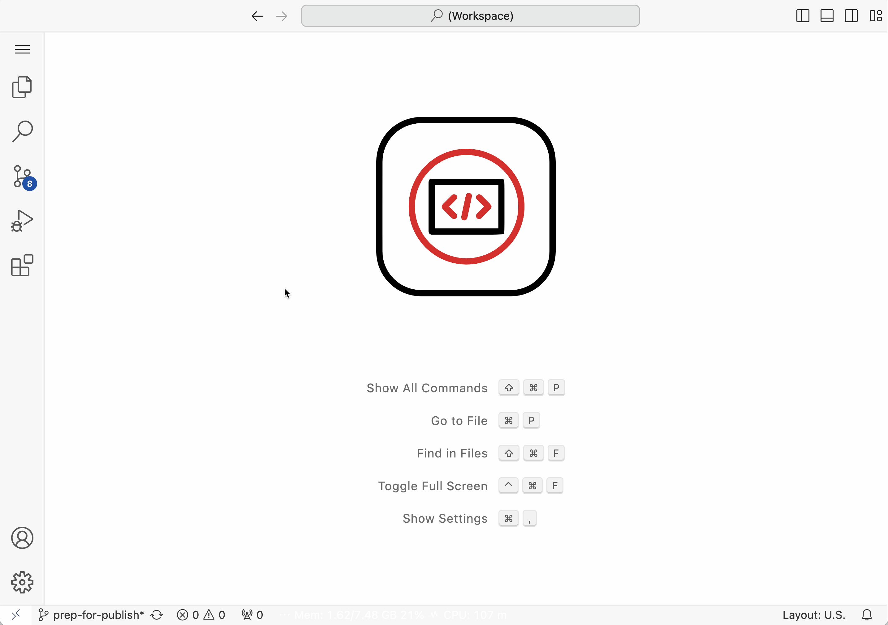

# Adding commands

You can use a devfile to specify some commands used recurrently in the development environment. For example the commands to build and test the application. 

```yaml
commands:
- id: command-1
  exec:
    label: Show Welcome Message
    component: dev
    commandLine: echo "${WELCOME}"
    workingDir: ${PROJECT_SOURCE}

```

After restarting the workspace with the Devfile, the specified commands are available as tasks in Visual Studio Code.



References:
- [Corresponding article in the Devfile documentation][def1]
- [`commands` in the Devfile API reference][def2]

[def1]: https://devfile.io/docs/2.2.2/adding-commands
[def2]: https://devfile.io/docs/2.2.2/devfile-schema#commands