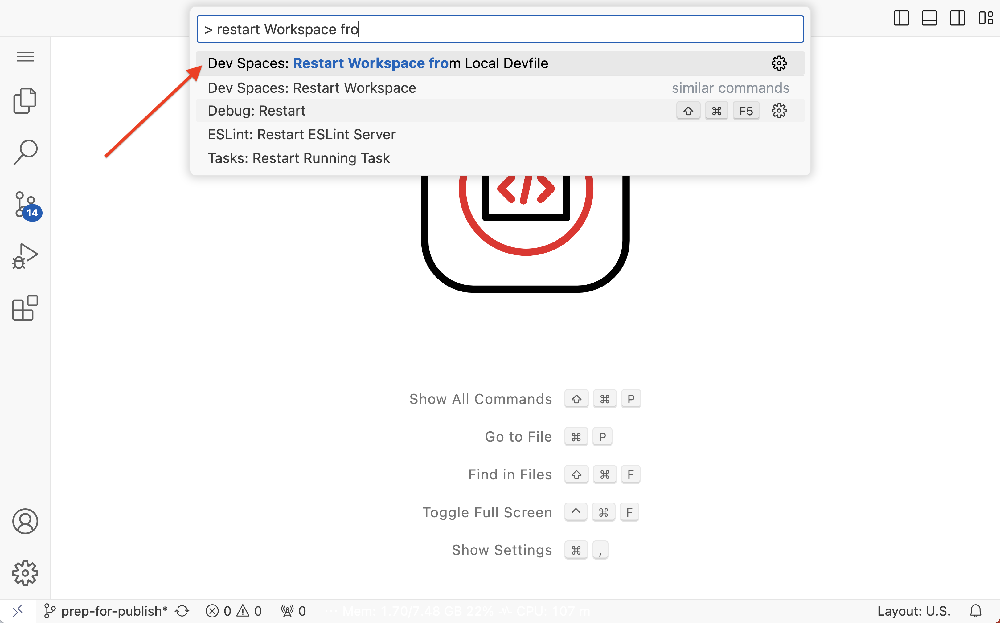
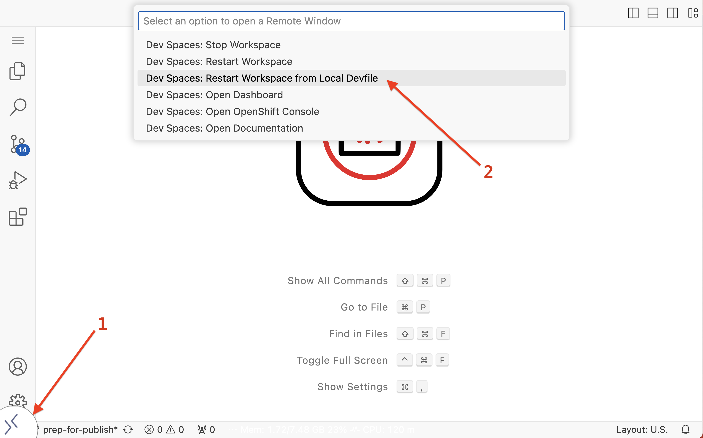

# Workspace Restart

Restart the Cloud Development Environment to try out the Devfile.

The command to restart the Cloud Development Environment from the Devfile is also available in Visual Studio Code command palette (CMD/CTR+P).

And from the button at the very left of the status bar too.

